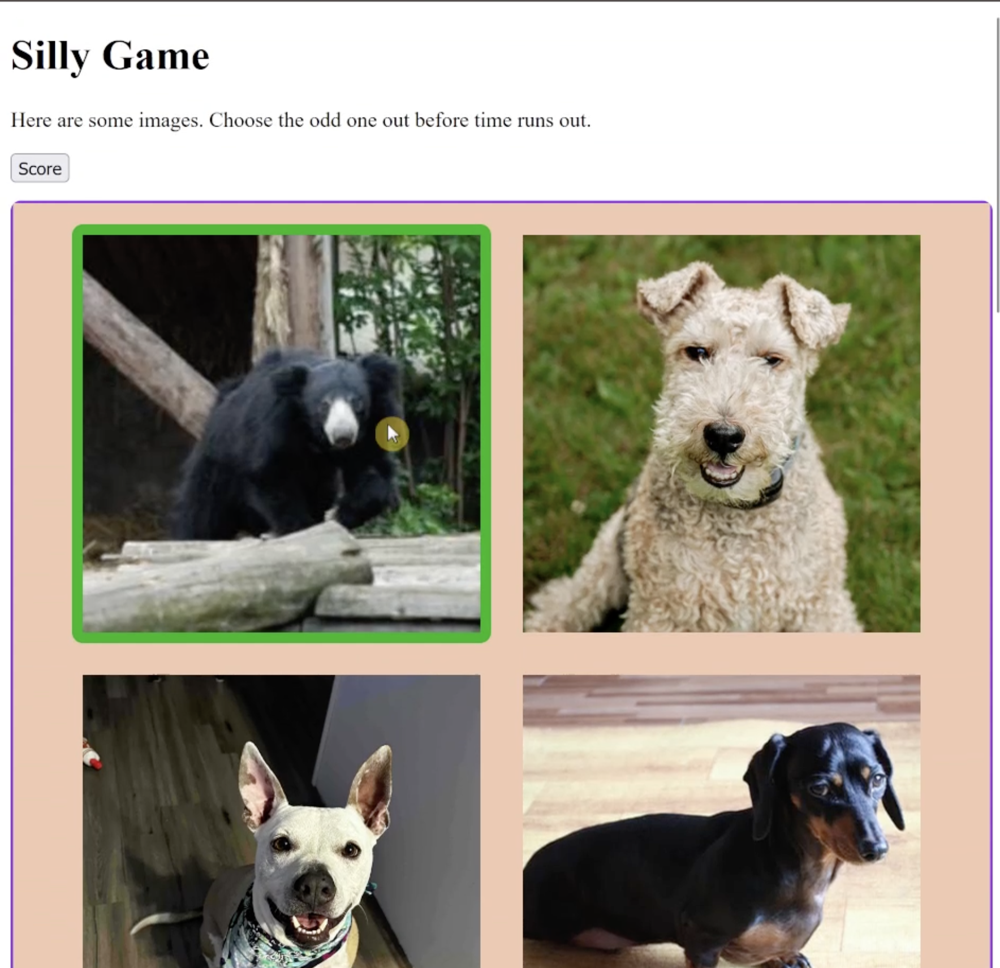

# Find The Imposter Game

Author: Talon Dunbar

## Overview

An silly interactive game where the user must find the imposters amongst groups of images before the timer runs out. When the user selects images they are given feedback indicating if they correctly found the imposter or not. The user's score is tallied dynamically and is displayed in a bar chart for the user to view during/after the game.

### Example Gameplay

### Stakeholder Requirements

This is where you should document your understanding of requirements ('the spec') 

## Setup

What does someone have to do to set up and run the app locally after they clone the repo?
What if they want to check code style at the command-line?

## Credits

Cite external sources and what they helped you with. 
(Please add comments above any code that was heavily inspired by external sources.)