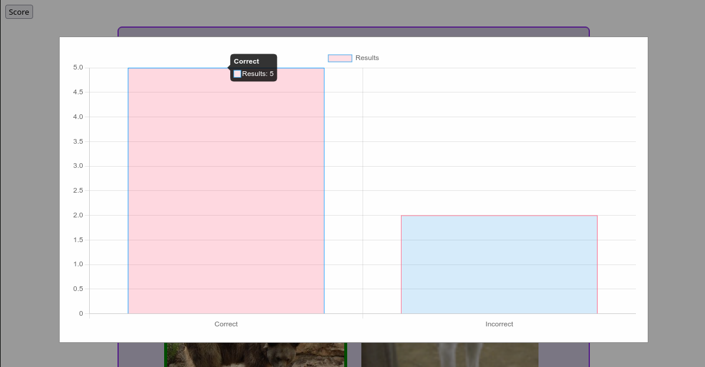

# Find The Imposter Game

Author: Talon Dunbar

## Overview

A silly interactive game where the user must find the imposters amongst groups of images before the timer runs out. When the user selects images they are given feedback indicating if they correctly found the imposter or not. The user's score is tallied dynamically and is displayed in a Chart.js bar chart for the user to view during/after the game.

### Example Gameplay

### Stakeholder Requirements

#### Game Overview

- An interactive website game where users play "Guess The Imposter" and identify the imposter image among groups of images.
- The game shows 20 images in 5 groups in a column, each with 4 images each in a 2 x 2 grid.

#### Image Management

- Images are either fetched from `localStorage` or a public image API.
- On page load, `localStorage` keys are randomized if images exist.
- If `localStorage` is empty or insufficient:
    - Fetch supplementary images from API.
    - Use delays between fetches requests to reduce server load.
    - Store each fetched image URL in `localStorage` using a numeric key (`0`, `1`, ...).
- Batches are stacked vertically, each with a random background color and containing 4 images.
- One image per batch is randomly replaced with an imposter image.

#### Gameplay Mechanics

- HTML classes are used to identify imposter and non-imposter images for interaction.
- Users can click multiple images per group.
- Correct guesses are highlighted with a green border.
- Incorrect guesses cause the image to fade (visual feedback).
- Global variables track correct and incorrect guesses to feed into a Chart.js bar chart.

#### Timing and Batch Handling

- Each batch of 4 images has a timer that automatically removes the batch after a specified delay.
- Timer delays are stored as constants for easy configuration.

#### Scoring and Feedback

- A "Score" button is available to view the current score during or after gameplay.
- The score is displayed as a dynamically updated bar chart indicating correct vs incorrect guesses.
- After all batches are removed, show a game-over message summarizing correct and incorrect guesses.

## Setup

### Prerequisites

- Git
- Node.js
- A modern web browser
- VS Code + Live Server Extension

### Steps

1. Clone the repository:
    - `git clone https://gitlab.com/dawson-cst-cohort-2026/520/section3/TalonDunbar/Assignment1.git`
2. Move into the directory
    - `cd Assignment1`
3. Run `npm install` to install the node packages.
4. Run the Live Server:
    1. Open VS Code.
    2. Right click on `index.html` and click "Open With Live Server".
    3. Access the game at `http://127.0.0.1:5500/index.html` by default.

If you'd like to check code quality or run linting from the command-line run: `npm run lint`.

## Credits

### Resources

- [Recursive Function Repeat (Stack Overflow)](https://stackoverflow.com/questions/35556876/javascript-repeat-a-function-x-amount-of-times)

### Tools

- [DOG CEO API](https://dog.ceo/dog-api/)
- [PlaceBear](https://placebear.com/)
- [ChartJS](https://www.chartjs.org/)